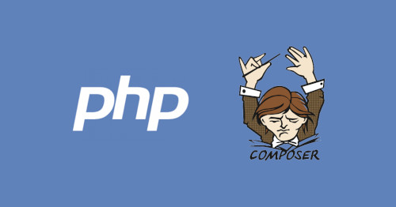

  
  <!--Adicionar logotipo do projeto aqui-->
  

    
  
 

  <h1>Curso PHP Composer</h1>
  
Projeto de um buscador de cursos, desenvolvido através do curso de PHP Composer, da plataforma Alura

  

    
  
 

  <!--Adicionar imagem/gif do projeto aqui-->
  

       
  

  ## 🔨 Seja um dos contribuidores 
  Quer fazer parte desse projeto? Clique [AQUI](CONTRIBUTING.md) e leia como contribuir.

  <a href='#voltar-topo'>⬆ Voltar ao topo</a> 
